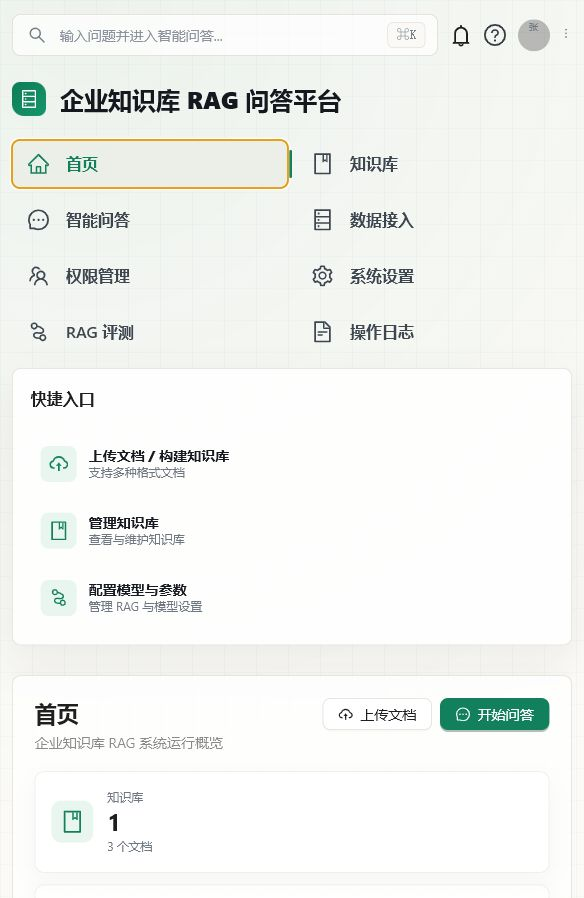
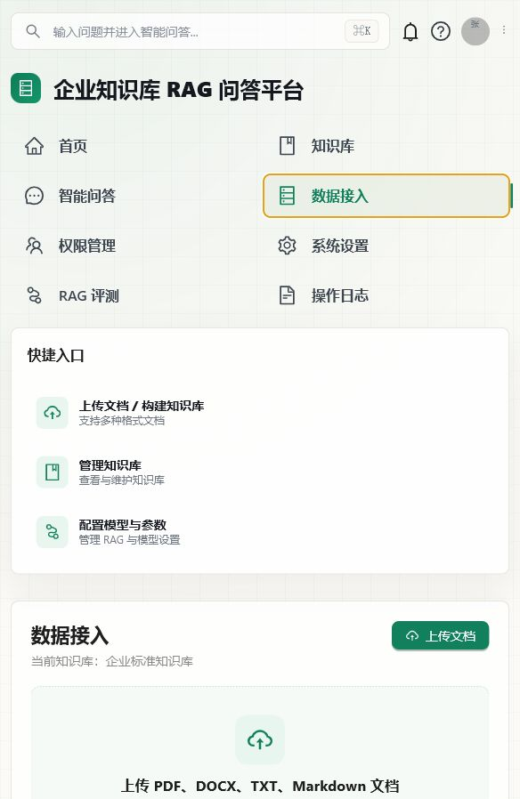
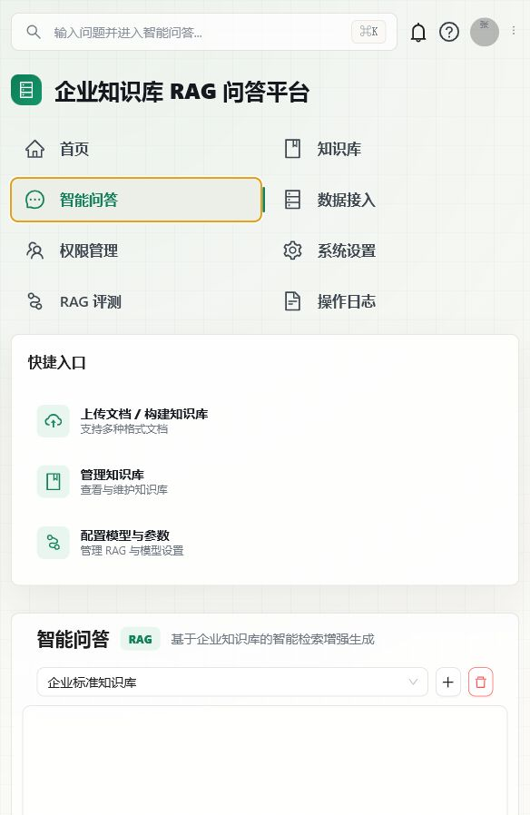
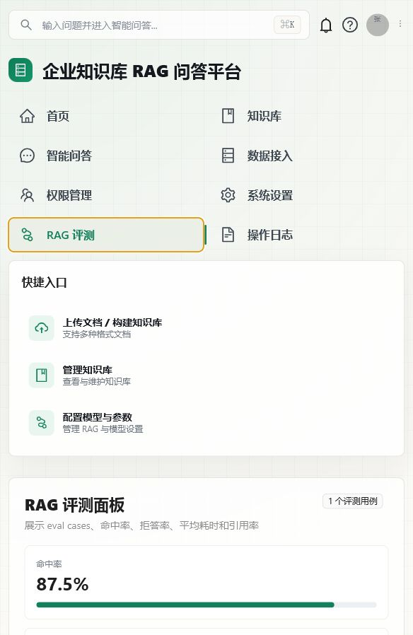
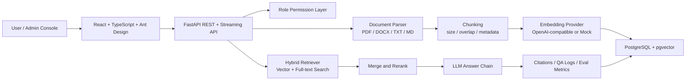

# Enterprise Knowledge RAG Platform

> 企业级知识库 RAG 问答平台。支持文档入库、自动切片、混合检索、引用溯源、权限控制、问答日志和 RAG 评测闭环。



<p align="center">
  <a href="#quick-start"></a>
  <a href="#tech-stack"></a>
  <a href="#tech-stack"></a>
  <a href="#tech-stack"></a>
  <a href="#testing"></a>
</p>

## Table of Contents

- [Why This Project](#why-this-project)
- [Preview](#preview)
- [Features](#features)
- [Architecture](#architecture)
- [Tech Stack](#tech-stack)
- [Quick Start](#quick-start)
- [Default Accounts](#default-accounts)
- [Configuration](#configuration)
- [API Overview](#api-overview)
- [Project Structure](#project-structure)
- [Testing](#testing)
- [Roadmap](#roadmap)

## Why This Project

This project is not a simple chatbot demo. It is a complete enterprise RAG workflow designed around real knowledge-base operations:

- Upload PDF, DOCX, TXT and Markdown files.
- Parse documents and split them into retrieval-ready chunks.
- Store embeddings in PostgreSQL with pgvector.
- Combine vector retrieval and full-text keyword retrieval.
- Generate answers with citations, evidence snippets and audit logs.
- Evaluate retrieval quality with built-in eval cases.
- Provide a polished admin console for document ingestion, model settings, permissions and logs.

## Preview

### Knowledge Ingestion

Upload enterprise documents, parse content, generate chunks and rebuild indexes when needed.



### RAG Question Answering

Ask questions against a selected knowledge base. The answer panel shows citations, retrieval evidence, confidence and model metadata.



### Evaluation Dashboard

Track retrieval hit rate, citation rate, latency and case-level evaluation results.



## Features

| Module | What it does |
| --- | --- |
| Knowledge Base | Create, switch and delete knowledge bases. Each knowledge base owns its documents, chunks and QA logs. |
| Document Ingestion | Upload PDF, DOCX, TXT and Markdown files. Parse text, split chunks, estimate tokens and build vector indexes. |
| Hybrid Retrieval | Retrieve evidence with vector similarity plus PostgreSQL full-text search, then merge and rerank results. |
| RAG Answering | Generate grounded answers with citations, retrieval snippets, latency, model name and prompt version. |
| Evidence Traceability | Inspect which document and chunk supported each answer. |
| Role Permissions | Demo roles for admin, manager, HR and employee, with scoped knowledge-base access. |
| Model Settings | Configure chat model, LLM mode and retrieval Top K from the console. |
| QA Logs | Audit questions, answers, citations, retrieval results, hit status and latency. |
| RAG Evaluation | Load eval cases and calculate hit rate, refusal rate, citation rate and average latency. |
| Docker Deployment | One command starts PostgreSQL, backend and frontend. |

## Architecture



## Tech Stack

| Layer | Technology |
| --- | --- |
| Frontend | React 18, TypeScript, Vite, Ant Design, Axios, Day.js |
| Backend | FastAPI, SQLAlchemy, Pydantic Settings, Uvicorn |
| Database | PostgreSQL 16, pgvector |
| Document Parsing | pypdf, python-docx, plain text and Markdown parser |
| RAG | Hybrid retrieval, lightweight rerank, prompt templates, citation grounding |
| Model Provider | Mock mode by default, OpenAI-compatible LLM and embedding APIs supported |
| DevOps | Docker Compose, Nginx reverse proxy |
| Tests | pytest for backend, TypeScript build check for frontend |

## Quick Start

### 1. Clone and configure

```bash
git clone https://github.com/jianmingz458-lgtm/enterprise-knowledge-rag.git
cd enterprise-knowledge-rag
cp .env.example .env
```

The default configuration uses mock LLM and mock embeddings, so you can run the project without any external API key.

### 2. Start all services

```bash
docker compose up -d --build
```

Windows users can also run:

```bat
start.bat
```

### 3. Open the console

| Service | URL |
| --- | --- |
| Frontend Console | http://localhost:5174 |
| Backend Health Check | http://localhost:8001/api/health |
| PostgreSQL | localhost:5433 |

### 4. Try the RAG workflow

1. Log in with the admin account.
2. Open the Knowledge Base page and select or create a knowledge base.
3. Open Data Ingestion and upload a PDF, DOCX, TXT or Markdown file.
4. Wait until the document status becomes completed.
5. Open Smart QA and ask a question related to the uploaded document.
6. Inspect citations, retrieval snippets and QA logs.

## Default Accounts

| Username | Password | Role | Access |
| --- | --- | --- | --- |
| admin | admin123 | Admin | Full access |
| manager | manager123 | Manager | Knowledge management and logs |
| hr | hr123 | HR | Policy knowledge bases and QA |
| employee | employee123 | Employee | Policy QA, read-oriented access |

## Configuration

The project reads environment variables from `.env`.

### Mock mode

```env
LLM_MODE=mock
EMBEDDING_MODE=mock
```

### OpenAI-compatible mode

```env
LLM_MODE=openai
EMBEDDING_MODE=openai
OPENAI_API_KEY=sk-xxx
OPENAI_BASE_URL=https://api.openai.com/v1
CHAT_MODEL=gpt-4o-mini
EMBEDDING_MODEL=text-embedding-3-small
EMBEDDING_DIM=1536
```

### Retrieval and ingestion

```env
CHUNK_SIZE=900
CHUNK_OVERLAP=140
MIN_CHUNK_SIZE=120
RETRIEVAL_TOP_K=8
ANSWER_MIN_SCORE=0.22
ANSWER_MIN_RERANK_SCORE=0.08
ANSWER_MIN_EVIDENCE_COUNT=1
PROMPT_VERSION=v1
UPLOAD_DIR=data/uploads
```

Note: `EMBEDDING_DIM` must match the embedding model output dimension. If you change the dimension, rebuild the database volume or recreate the vector table.

## API Overview

| Method | Endpoint | Description |
| --- | --- | --- |
| POST | `/api/auth/login` | Login and receive an access token |
| GET | `/api/auth/me` | Get current user |
| POST | `/api/auth/switch-role` | Switch demo role |
| GET | `/api/knowledge-bases` | List knowledge bases |
| POST | `/api/knowledge-bases` | Create a knowledge base |
| DELETE | `/api/knowledge-bases/{kb_id}` | Delete a knowledge base |
| GET | `/api/knowledge-bases/{kb_id}/documents` | List documents |
| POST | `/api/knowledge-bases/{kb_id}/documents` | Upload and index a document |
| GET | `/api/documents/{document_id}/chunks` | Inspect document chunks |
| POST | `/api/documents/{document_id}/rebuild` | Rebuild document index |
| POST | `/api/knowledge-bases/{kb_id}/ask` | Ask with normal HTTP response |
| POST | `/api/knowledge-bases/{kb_id}/ask/stream` | Ask with streaming response |
| GET | `/api/qa-logs` | List QA logs |
| GET | `/api/eval/summary` | Get RAG evaluation summary |
| GET / PUT | `/api/model-config` | Read or update model settings |

## Project Structure

```text
.
├── backend/
│   ├── app/
│   │   ├── api/              # FastAPI routes
│   │   ├── core/             # settings
│   │   ├── db/               # database session and init
│   │   ├── models/           # SQLAlchemy entities
│   │   ├── schemas/          # API schemas
│   │   └── services/         # auth, parsing, chunking, retrieval, RAG
│   ├── prompts/              # prompt templates
│   ├── scripts/              # evaluation script
│   └── tests/                # backend tests
├── frontend/
│   ├── src/
│   │   ├── api/              # API client
│   │   ├── types/            # TypeScript types
│   │   ├── App.tsx           # console pages and interactions
│   │   └── styles.css        # UI styling
│   └── nginx.conf            # production reverse proxy
├── infra/
│   └── init.sql              # PostgreSQL and pgvector init
├── docs/images/              # README screenshots
├── data/                     # sample data and local uploads
├── docker-compose.yml
└── eval_cases.json
```

## Testing

### Backend

```bash
cd backend
pytest
```

### Frontend

```bash
cd frontend
npm install
npm exec tsc -- --noEmit
npm run build
```

Current notes:

- The frontend project does not provide a lint script yet.
- The frontend project does not provide a test script yet.
- `npm run build` may report a Vite chunk-size warning because the admin console is currently bundled as one main app.

## Roadmap

- Add asynchronous background indexing with task progress polling.
- Add document deletion and batch reindexing.
- Add configurable chunking strategy per knowledge base.
- Add model provider presets for more OpenAI-compatible gateways.
- Add frontend unit tests and end-to-end tests.
- Add production deployment examples for cloud servers.

## License

This project is intended for learning, portfolio display and internal RAG workflow exploration.
